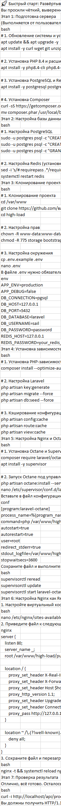

# Быстрый старт: Развёртывание Laravel Octane на VPS		

> Чёткий, выверенный алгоритм, который можно использовать как шпаргалку. Он разбит на логические этапы, которые удобно выполнять один за другим.

## Этап 1: Подготовка сервера		
(Выполняется от пользователя root)		
```bash		
# 1. Обновление системы и установка базовых утилит		
apt update && apt upgrade -y		
apt install -y curl wget git unzip nginx		
		
# 2. Установка PHP 8.4 и расширений		
apt install -y php8.4-cli php8.4-fpm php8.4-pgsql php8.4-xml php8.4-curl php8.4-mbstring php8.4-zip php8.4-bcmath php8.4-swoole		
		
# 3. Установка PostgreSQL и Redis		
apt install -y postgresql postgresql-contrib redis-server		
		
# 4. Установка Composer		
curl -sS https://getcomposer.org/installer | php		
mv composer.phar /usr/local/bin/composer	
```
	
# Этап 2: Настройка базы данных и Redis		
```bash		
# 1. Настройка PostgreSQL		
sudo -u postgres psql -c "CREATE DATABASE laravel;"		
sudo -u postgres psql -c "CREATE USER sail WITH PASSWORD 'password';"		
sudo -u postgres psql -c "GRANT ALL PRIVILEGES ON DATABASE laravel TO sail;"		
		
# 2. Настройка Redis (установка пароля)		
sed -i 's/# requirepass .*/requirepass your_redis_password/' /etc/redis/redis.conf		
systemctl restart redis	
```

## Этап 3: Клонирование проекта и настройка .env		
```bash		
# 1. Клонирование проекта		
cd /var/www		
git clone https://github.com/ваш-логин/ваш-проект.git high-load		
cd high-load		
		
# 2. Настройка прав		
chown -R www-data:www-data storage bootstrap/cache		
chmod -R 775 storage bootstrap/cache		
		
# 3. Настройка окружения		
cp .env.example .env		
nano .env		
В файле .env нужно обязательно обновить параметры подключения к БД и Redis:		
env		
APP_ENV=production		
APP_DEBUG=false		
DB_CONNECTION=pgsql		
DB_HOST=127.0.0.1		
DB_PORT=5432		
DB_DATABASE=laravel		
DB_USERNAME=sail		
DB_PASSWORD=password		
REDIS_HOST=127.0.0.1		
REDIS_PASSWORD=your_redis_password	
```
	
## Этап 4: Установка зависимостей и кэширование		
```bash		
# 1. Установка PHP-зависимостей		
composer install --optimize-autoloader --no-dev		
		
# 2. Настройка Laravel		
php artisan key:generate		
php artisan migrate --force		
php artisan db:seed --force		
		
# 3. Кэширование конфигурации		
php artisan config:cache		
php artisan route:cache		
php artisan view:cache
```
		
## Этап 5: Настройка Nginx и Octane		
```bash		
# 1. Установка Octane и Supervisor		
composer require laravel/octane		
apt install -y supervisor		
		
# 2. Запуск Octane под управлением Supervisor		
php artisan octane:install --server=swoole		
nano /etc/supervisor/conf.d/laravel-octane.conf		
Вставьте в файл конфигурацию (предварительно заменив в ней /var/www/high-load на путь к вашему проекту):		
conf		
[program:laravel-octane]		
process_name=%(program_name)s		
command=php /var/www/high-load/artisan octane:start --server=swoole --port=8000 --workers=4 --max-requests=500		
autostart=true		
autorestart=true		
user=root		
redirect_stderr=true		
stdout_logfile=/var/www/high-load/storage/logs/octane.log		
stopwaitsecs=3600		
Сохраните файл и выполните:		
bash		
supervisorctl reread		
supervisorctl update		
supervisorctl start laravel-octane
```
		
## Этап 6: Настройка Nginx как Reverse Proxy		
1. Настройте виртуальный хост Nginx для проксирования трафика на Octane.		
```bash		
nano /etc/nginx/sites-available/default	
```
	
2. Приведите файл к следующему виду:		
```nginx		
server {		
    listen 80;		
    server_name _;		
    root /var/www/high-load/public;		
		
    location / {		
        proxy_set_header X-Real-IP $remote_addr;		
        proxy_set_header X-Forwarded-For $proxy_add_x_forwarded_for;		
        proxy_set_header Host $host;		
        proxy_http_version 1.1;		
        proxy_set_header Upgrade $http_upgrade;		
        proxy_set_header Connection "upgrade";		
        proxy_pass http://127.0.0.1:8000;		
    }		
		
    location ~ /\.(?!well-known).* {		
        deny all;		
    }		
}	
```
	
3. Сохраните файл и перезагрузите Nginx.		
```bash		
nginx -t && systemctl reload nginx	
```
	
## Этап 7: Проверка результата		
Отлично, всё готово. Осталось выполнить финальную проверку работоспособности:		
```bash		
curl -i http://localhost/api/products/1	
```	
Вы должны получить HTTP/1.1 200 OK и JSON-ответ.		
