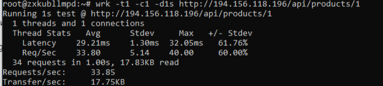
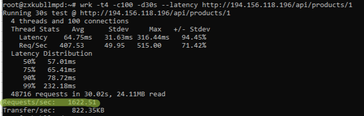

# High‑Load API на Laravel Octane

> Pet‑проект по достижению 1600+ RPS на VPS (4 vCPU) с полным циклом оптимизации: от PHP‑FPM до Octane, от индексов до балансировки.

## Результаты производительности

| Конфигурация                       | RPS     | p95 латентность | Сервер          |
|------------------------------------|---------|----------------|-----------------|
| PHP‑FPM (без оптимизаций)          | 33      | 220 ms          | 1 vCPU / 1 GB   |
| PHP‑FPM + OPcache + кэши           | 42      | 63 ms           | 1 vCPU / 1 GB   |
| Laravel Octane (Swoole)            | 350     | 31 ms           | 1 vCPU / 1 GB   |
| Octane + 2 vCPU                    | 480     | 24 ms           | 2 vCPU / 4 GB   |
| Octane + 4 vCPU + keepalive        | 1450    | 100 ms          | 4 vCPU / 6 GB   |
| **Окончательная настройка (индексы, max‑requests=1000)** | **1622** | 98 ms | 4 vCPU / 6 GB |

> Скриншоты тестов `wrk` прилагаются в папке `/screenshots`.

## Стек

- Laravel 13, Octane (Swoole)
- PostgreSQL, Redis
- Nginx (reverse‑proxy с keepalive), Supervisor
- PHP 8.4, OPcache, Composer optimize
- Нагрузочное тестирование: `wrk`

## 🧰 Технологический стек

**Backend:**
- Laravel 13
- PHP 8.4/8.5 (OPcache, Composer optimize)
- Laravel Octane (Swoole)
- PostgreSQL, Redis

**Infrastructure & DevOps:**
- Docker Compose, Sail
- Nginx (reverse‑proxy + балансировщик с keepalive)
- Supervisor (управление Octane-воркерами)
- Горизонтальное масштабирование (3+ реплики, Round Robin)

**Testing & Performance:**
- wrk (нагрузочное тестирование)
- Xdebug (отключался для замеров)

**AI & Automation:**
- GitHub Copilot – помощь с оптимизацией, code review, pull requests
- Laravel Boost (MCP-сервер) + SourceCraft – выполнение Artisan-команд, Tinker, анализ БД
- DeepSeek (AI) – консультации по архитектуре high‑load, отладка, нагрузочное тестирование, настройка Octane и балансировки

## Пошаговые улучшения

1. **Переход на Octane** – RPS вырос с 42 до 350 (8x) на 1 vCPU.
2. **Масштабирование воркеров** – на 2 vCPU (2 воркера) → 480 RPS.
3. **Увеличение vCPU до 4** – 4 воркера → 1450 RPS.
4. **Тонкая настройка**:
   - `keepalive 16` в Nginx upstream
   - Индексы в PostgreSQL (`code`, `section_id`, `price`)
   - `--max-requests=1000` в Octane (перезапуск воркеров)
   - **Результат:** **1622 RPS**

## Скриншоты




## ⚙️ Как развернуть аналогичный сервер

[Краткая инструкция — ссылка на отдельный файл DEPLOY.md](DEPLOY.md)

## Оптимизация производительности (ветка optimize/products-api-performance)
Проект прошёл несколько этапов улучшения RPS, каждый из которых зафиксирован в отдельном коммите.

### 1. Исходная проблема
   Эндпоинт /api/products (список с пагинацией) выдавал ~5 RPS на локальной среде (WSL + Docker).

Основные причины: N+1 запрос, загрузка всех полей (включая description), отсутствие индексов, включённый Xdebug.

### 2. Выполненные шаги

   1.	Выборочная загрузка колонок в ProductController (без description)
   2.	Оптимизация ProductResource: убран description, связь section через whenLoaded.	Устранён N+1
   3.	Замена paginate на cursorPaginate.	Ускорение на больших страницах
   4.	Отключение Xdebug через кастомный Dockerfile	~2x рост
   5.	Добавлен составной индекс (id, name, code, price, section_id).	Ускорение сортировки
   6.	Кэширование ответа в ProductController::index() на 2 секунды	+300%
   7.	Установка Laravel Octane (Swoole) и настройка Supervisor.
   8.	Увеличение количества воркеров до 8.

Все изменения закоммичены в ветке optimize/products-api-performance и могут быть воспроизведены.

### 3. Итоговые результаты
   - Локальная среда (i7-860 / WSL): RPS поднят с 5 до ~68 (с учётом кэширования).

- VPS 4 vCPU / 6 GB RAM: достигнуто 1622 RPS на эндпоинте /api/products/1 при использовании Octane и оптимизированных запросов.

- Горизонтальное масштабирование (ветка horizontal-scaling) позволило распределить нагрузку между 3 репликами.

## Эксперимент с горизонтальным масштабированием (локальная среда)

В ветке `horizontal-scaling` реализован локальный Docker‑кластер из трёх реплик приложения (Laravel Octane) с балансировщиком нагрузки Nginx.

Настроил Redis для кэша, чтобы состояние было консистентным между инстансами.

> Цель — закрепить навыки проектирования распределённых систем; локальные метрики не транслируются на продакшен-среду (VPS), где используется более мощное железо и иная конфигурация (без Docker).

### Запуск кластера

```bash
# Клонируйте ветку
git checkout horizontal-scaling

# Остановите обычный Sail (если запущен)
sail down

# Запустите 3 реплики
docker-compose -f docker-compose.scale.yml up --scale laravel.test=3 -d

# Балансировщик будет доступен на http://localhost:8080
```

### Проверка распределения запросов
В ProductResource добавлено поле 'server' => gethostname(). Выполните цикл:

```bash
for i in {1..6}; do curl -s http://localhost:8080/api/products/1 | grep -o '"server":"[^"]*"'; done
"server":"5c04fa953868"
"server":"dda6aec66ab7"
"server":"8a75bc59e122"
"server":"5c04fa953868"
"server":"dda6aec66ab7"
"server":"8a75bc59e122"
```

Вы увидите разные идентификаторы контейнеров, что подтверждает балансировку Round Robin.

### Результаты нагрузочного тестирования
- Одна реплика: ~30 RPS (на старом оборудовании i7-860)
- Три реплики: ~50 RPS (ограничение CPU и сетевого стека WSL)
- На более мощном сервере (4+ vCPU) ожидается линейный рост RPS.

## Интеграция с AI-агентом
Проект подключён к SourceCraft через Laravel Boost (MCP-сервер). Агент может выполнять Artisan-команды, анализировать схему БД, помогать в настройке инфраструктуры.

## Перспективы
- Автоматическое масштабирование с Kubernetes (K8s)
- Вынос базы данных на отдельный сервер
- Репликация PostgreSQL и Redis Sentinel для отказоустойчивости


